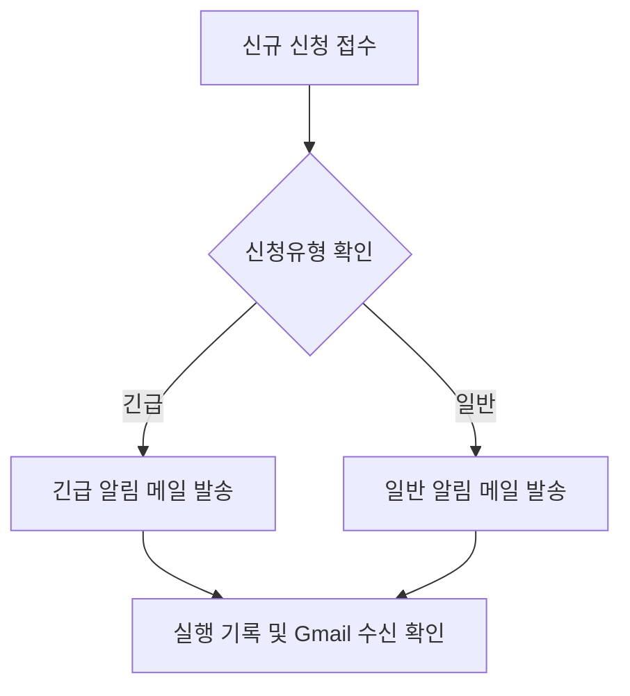

# 자동화 도구 비교 구현 프로젝트

> Google Forms로 접수된 신청을 **긴급/일반으로 분류**하고, 담당자에게 Gmail 알림을 자동 발송하는 동일 업무를 **Make**와 **Zapier**로 구현·비교한 프로젝트입니다.

## 1. 프로젝트 개요

### 목적

- 반복적으로 발생하는 신청 확인 및 전달 업무 자동화
- Make와 Zapier에서 동일한 업무 흐름 구현
- 조건 분기, 실행 결과, 사용성 및 유지관리 방식 비교

### 자동화 대상 업무

| 단계 | 처리 내용 |
|---|---|
| 입력 | Google Forms에서 이름, 성별, 신청유형 등의 정보 제출 |
| 저장 | 응답 데이터를 Google Sheets에 저장 |
| 판단 | 신청유형이 `긴급`인지 `일반`인지 확인 |
| 처리 | 조건에 맞는 담당자에게 Gmail 알림 발송 |
| 확인 | Gmail 받은편지함과 자동화 실행 기록에서 결과 확인 |

> **자동화 범위:** 메일 수신자는 신청자가 아니라 담당자입니다. 접수 사실과 신청 정보를 전달하는 내부 알림으로 사용했습니다.

## 2. 공통 워크플로우

두 도구 모두 다음과 같은 논리 구조로 구현했습니다.



| 구분 | Make | Zapier |
|---|---|---|
| Trigger | Google Sheets · Watch New Rows | Google Forms · New Form Response |
| 조건 분기 | Router + 경로별 Filter | 조건별 Zap의 Filter by Zapier |
| Action 1 | 긴급 담당자 Gmail 발송 | 긴급용 Zap의 Gmail 발송 |
| Action 2 | 일반 담당자 Gmail 발송 | 일반용 Zap의 Gmail 발송 |
| 결과 확인 | Scenario 실행 기록 + Gmail 수신 | Zap 실행/테스트 기록 + Gmail 수신 |

## 3. Make 구현

### 3.1 Trigger 설정

Google Forms 응답이 저장되는 Google Sheets를 시작 모듈로 사용하고, `Watch New Rows`로 신규 행을 감지했습니다.


### 3.2 Router 및 Filter 설정

Router에서 신청유형에 따라 경로를 나누고, 각 경로에 다음 조건을 설정했습니다.

- 긴급 경로: `신청유형 = 긴급`
- 일반 경로: `신청유형 = 일반`


### 3.3 Gmail Action 설정

각 분기 뒤에 Gmail `Send an Email` 모듈을 연결했습니다. 받는 사람은 담당자 이메일로 지정하고, 제목과 본문에는 이름·성별·신청유형을 매핑했습니다.


### 3.4 전체 시나리오

하나의 시나리오에서 `Google Sheets → Router → 긴급 Gmail / 일반 Gmail` 구조로 구성했습니다.


### 3.5 실행 결과

긴급 및 일반 테스트 데이터를 각각 입력한 뒤, 담당자 Gmail 받은편지함에서 두 유형의 알림 메일이 자동 수신된 것을 확인했습니다.


## 4. Zapier 구현

### 4.1 Trigger 설정

Google Forms의 `New Form Response`를 Trigger로 선택하고 테스트 응답을 불러와 후속 단계에서 사용할 필드를 확인했습니다.


### 4.2 조건별 Zap 분리

구현 당시 환경의 기능 제약을 고려해 하나의 Zap 안에서 Paths로 분기하지 않고, **긴급용 Zap**과 **일반용 Zap**을 각각 만들었습니다. 두 Zap은 같은 구조를 가지며 Filter 조건만 다릅니다.


### 4.3 Filter 및 Gmail Action 설정

각 Zap에 `Filter by Zapier`를 추가하여 해당 신청유형만 Gmail 단계로 통과시켰습니다.

```text
긴급용 Zap: Google Forms → Filter(신청유형=긴급) → Gmail
일반용 Zap: Google Forms → Filter(신청유형=일반) → Gmail
```


### 4.4 테스트 및 실행 결과

Gmail 단계의 Test를 실행해 전송 성공을 확인했고, 받은편지함에서 이름·성별·신청유형이 포함된 메일을 확인했습니다.


## 5. 요구사항 충족 확인

| 요구사항 | Make 구현 | Zapier 구현 | 결과 |
|---|---|---|:---:|
| Trigger 1개 이상 | Google Sheets `Watch New Rows` | Google Forms `New Form Response` | ✅ |
| Action 2개 이상 | 긴급 Gmail + 일반 Gmail | 긴급용 Gmail + 일반용 Gmail | ✅ |
| Filter/Router 1개 이상 | Router + 경로별 Filter | 각 Zap의 Filter | ✅ |
| 각 분기 1회 이상 실행 확인 | 긴급·일반 경로 및 수신 메일 확인 | 두 조건의 테스트/실행 및 수신 메일 확인 | ✅ |
| 서로 다른 자동화 도구 2개 이상 | Make | Zapier | ✅ |
| 동일한 워크플로우 구조 | 입력 → 조건 판단 → 조건별 메일 → 결과 확인 | 입력 → 조건 판단 → 조건별 메일 → 결과 확인 | ✅ |

## 6. 비교 분석

| 비교 항목 | Make | Zapier |
|---|---|---|
| UI/UX | 모듈과 연결선으로 전체 데이터 흐름을 한눈에 확인하기 좋음 | Trigger, Filter, Action을 단계별로 설정해 순서대로 따라가기 쉬움 |
| 설정 난이도 | Router, 번들, 매핑, 모듈 개념에 대한 초기 학습 필요 | 기본 설정은 직관적이나 기능·플랜 제약을 확인해야 함 |
| 조건 분기 | Router로 하나의 시나리오 안에서 여러 경로 관리 가능 | 구현 당시에는 조건별 Zap 두 개로 분리하여 관리 |
| 무료 플랜 활용 | Router와 Filter를 포함한 시나리오 구성 가능 | 무료 플랜의 다단계·Paths 제한으로 동일 구현 시 제약 가능 |
| 실행 로그 | 모듈별 처리 데이터와 분기 흐름을 시각적으로 확인하기 쉬움 | Zap runs/History에서 단계별 통과·중단·성공 여부 확인 가능 |
| 유지관리 | 한 화면에서 두 경로를 함께 수정 가능 | 두 Zap의 조건과 메일 내용을 각각 수정해야 해 중복 작업 발생 가능 |
| 연동 및 확장 | 다양한 앱, 데이터 변환, AI 모듈을 조합한 복잡한 흐름에 적합 | 다양한 앱과 AI 기능을 단계별로 빠르게 연결하기 편리 |

> **플랜 정보 확인 필요:** 요금제와 제공 기능은 변경될 수 있습니다. 2026-07-19 기준 Make는 무료 플랜에 Router와 Filter를 명시하고 있으며, Zapier는 Paths와 다단계 Zap을 유료 기능의 예로 안내합니다. 실제 재구현 전 공식 페이지를 다시 확인하세요.

## 7. 장단점 및 적합한 상황

### Make

**장점**

- 하나의 시나리오에서 여러 조건 경로를 통합 관리할 수 있음
- 데이터 흐름과 분기 관계가 시각적으로 명확함
- 복잡한 데이터 가공과 다중 서비스 연동으로 확장하기 좋음

**단점**

- 모듈, 번들, 매핑, Router 등의 개념을 익혀야 함
- 단순 자동화만 필요한 사용자에게는 설정 화면이 복잡하게 느껴질 수 있음

**적합한 상황:** 조건이 많고 여러 앱·데이터 변환을 한 화면에서 관리해야 하는 복잡한 업무

### Zapier

**장점**

- 단계별 설정 방식이 직관적이며 빠르게 구현 가능
- Google Forms, Gmail 등 서비스 연결과 테스트가 간편함
- 비개발자가 단순 반복 업무를 자동화하기 좋음

**단점**

- 플랜에 따라 다단계 흐름과 Paths 사용이 제한될 수 있음
- 조건별 Zap을 분리하면 동일 설정을 중복 수정해야 할 수 있음

**적합한 상황:** 단순한 Trigger–Action 자동화, 빠른 시범 제작, 비개발자가 관리하는 반복 업무

## 8. 최종 의견

- **단순한 단일 조건 자동화와 빠른 테스트**에는 Zapier가 편리했습니다.
- **여러 조건과 데이터 흐름을 한 화면에서 통합 관리**해야 하는 경우에는 Make가 더 적합했습니다.
- 이번 구현에서는 Make가 긴급/일반 경로를 하나의 시나리오로 관리해 유지관리가 쉬웠고, Zapier는 설정이 직관적인 대신 두 Zap을 별도로 관리해야 했습니다.

## 참고 자료

- [Make 요금제 및 기능](https://www.make.com/en/pricing)
- [Zapier 무료 플랜 안내](https://help.zapier.com/hc/en-us/articles/32337438839565-What-s-included-in-Zapier-s-Free-plan)
- [Zapier 실행 제한 및 유료 기능 안내](https://help.zapier.com/hc/en-us/articles/8496216132621-Zap-is-not-running)

---

이 README는 첨부된 제출용 보고서의 구현 내용과 증빙 이미지를 바탕으로 작성했습니다.
